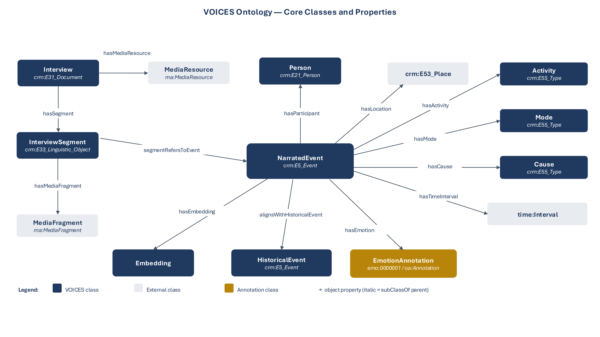
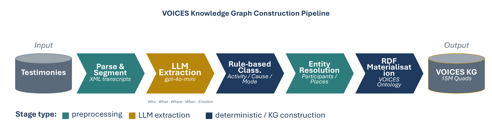

# VOICES Knowledge Graph — v2

[](LICENSE)
[](LICENSE-DATA.md)
[](https://iswc2026.semanticweb.org/)
[](https://doi.org/10.5281/zenodo.20707053)

Companion release to the ISWC 2026 Resources Track paper:

> **VOICES: An Ontology and Knowledge Graph for Modelling Multimodal
> Holocaust Survivor Testimonies.**

VOICES models Holocaust survivor testimonies — interviews, segments,
narrated events, places, emotions, embeddings, and alignments to external
authorities — as a Linked Data resource. The repository ships an OWL 2
ontology, a populated knowledge graph (≈16.7 M quads across seven named
graphs), an alignment graph linking minted place IRIs to GeoNames and
Wikidata, a reproducible evaluation framework, and a Dockerised
exploration stack (Fuseki + FastAPI + Streamlit + Caddy).

---

> ## ⚠️ Data notice — read before running
>
> **The testimony transcript text is not ours and is not redistributed
> here.** It is sourced from the **USC Shoah Foundation Visual History
> Archive (VHA)** and remains copyrighted by its rights-holders.
>
> - The public KG dump shipped in this repository
>   (`output/kg2026_v2_public.nq`) **excludes** the ~647 K
>   `voices:transcriptText` literals. All other graphs are intact and
>   queryable, so the app runs fully without the transcript text.
> - The full dump with transcript text (`output/kg2026_v2.nq`) **must not
>   be published or redistributed.** It is for local replication by
>   researchers who already hold their own VHA access.
> - To obtain the original transcript text, use the USC Shoah Foundation
>   VHA at <https://sfi.usc.edu/vha>.
>
> See [Transcript text](#transcript-text) and
> [`LICENSE-DATA.md`](LICENSE-DATA.md) for the full licensing matrix.

---

## Conceptual model

The ontology centres a `NarratedEvent` hub linking the `Interview` /
`InterviewSegment` spine to typed dimensions (participants, places,
activity, cause, mode, time, emotion, embeddings) and to a `HistoricalEvent`
side reference for outward alignment.



A four-stage pipeline parses 982 XML transcripts into 647,455 utterances,
extracts 334,434 narrated events via an LLM, enriches them with GeoNames
and Wikidata authorities, and materialises the result into seven named
graphs in N-Quads.



---

## Contents of this repository

| Path | What |
|---|---|
| [`schema/`](schema/) | Ontology (`voices_ontology_v2.ttl`), alignment graph (`voices-alignment-v2.ttl`), VoID/DCAT description (`voices_void.ttl`), and the VOICES↔EHRI cross-walk (`voices-ehri-bridge.ttl`) |
| [`pipeline/`](pipeline/) | **KG construction pipeline** (Stage 1 parse → Stage 2 LLM extraction → Stage 3 enrichment → Stage 4 materialisation; paper §4) |
| [`src/`](src/) | Public-release post-processing (transcript/thesaurus stripping and place re-minting) applied to the built KG |
| [`app/`](app/) | Streamlit exploration UI |
| [`admin/`](admin/) | FastAPI auth + admin + REST API |
| [`docker/`](docker/) | Caddy + Fuseki container configuration |
| [`scripts/`](scripts/) | Build, deploy, indexing, and CI gate scripts |
| [`queries/`](queries/) | 15 SPARQL competency-question queries (`cq01..cq15`) |
| [`evaluation/`](evaluation/) | Reproducible evaluation framework (alignment + events) |
| [`output/`](output/) | Pre-built KG dumps, embeddings, and statistics |
| [`docs/`](docs/) | Figures and supporting documentation |

---

## Quick start

Pick the entry point that matches your goal — you do **not** need the full
authenticated stack just to query the data.

**A · Query the data, zero install.** The public, transcript-stripped dump
(`kg2026_v2_public.nq`, CC BY 4.0) is downloadable **without any login** from the
Zenodo archive (DOI `10.5281/zenodo.20707053`) or the deployed `/downloads/` path.
Load it into any SPARQL store and run the ready-made example queries in
[`queries/`](queries/) (`cq01..cq15`), e.g. with Apache Jena:

```bash
arq --data=kg2026_v2_public.nq --query=queries/cq03_aligned_places.rq
```

The deployed resource also exposes a **public** SPARQL 1.1 endpoint at `/sparql`
and a read-only REST API under `/api/` (no authentication — transcript text is the
only gated layer).

**B · Browse locally without login.** Bring the stack up with authentication
disabled to explore the graph in the web UI:

```bash
cp .env.example .env          # then set REQUIRE_AUTH=false
make up && make load && make index
# open the explorer at https://localhost:8443/ (accept the self-signed cert)
```

**C · Full production-like stack** (auth, admin console, REST, edge proxy):
follow [Run it](#run-it) below.

---

## Run it

**This release ships the pre-built knowledge graph in `output/`** — you do
**not** need to rebuild anything to run the stack. The only prerequisite is
**Docker + Docker Compose**.

```bash
cd voices-kg

# 1. Create your local config, then edit the secrets
cp .env.example .env
#    In .env set: ADMIN_PASSWORD, JWT_SECRET,
#                 FUSEKI_ADMIN_PASSWORD, MEILI_MASTER_KEY

# 2. Start the stack (Fuseki, Redis, Meilisearch, Admin API, Streamlit, Caddy)
make up

# 3. Load the KG + embeddings into Fuseki (first run only, ~10 min)
make load

# 4. Build search indexes and dropdown caches
make index
make precompute

# 5. Create the first admin user (idempotent)
make seed

# 6. Run end-to-end smoke tests
make smoke
```

Open <https://localhost:8443> and accept Caddy's self-signed certificate.

> Rebuilding the dataset from the upstream v1 source is a **maintainer-only**
> step and is **not** required to run the stack — see
> [Rebuilding from v1 source](#rebuilding-from-v1-source-maintainers).

### Demo credentials

The first admin user is created from `.env` by `make seed`:

| Role  | Email                | Password                                |
|-------|----------------------|-----------------------------------------|
| admin | `admin@voices.local` | *(set via `ADMIN_PASSWORD` in `.env`)* |

> **Set a strong `ADMIN_PASSWORD` in `.env` before starting the stack.**
> Re-run `make seed` after any change.

The admin console is at <https://localhost:8443/admin/> — create
reviewer-role users there; they log in at the same URL and browse the
exploration UI at `/`.

---

## Architecture

```
             ┌──────────────────── Caddy (HTTPS, :8443) ────────────────────┐
             │                                                              │
Browser ───► │  /auth/*, /admin/*, /api/*  →  FastAPI  (auth, admin, REST)  │
             │  /sparql, /$/*              →  Fuseki   (TDB2 + Lucene)      │
             │  /downloads/*, /ontology/*  →  static (Caddy file_server)    │
             │  /                          →  Streamlit (forward_auth)      │
             │                                                              │
             └────────────────┬───────────────┬────────────────┬────────────┘
                              │               │                │
                          ┌───┴───┐     ┌─────┴─────┐    ┌─────┴──────┐
                          │ Redis │ ◄──│  FastAPI   │──► │ Meilisearch│
                          │(cache)│     │  + SQLite  │    │ (full-text)│
                          └───────┘     └────────────┘    └────────────┘
                                              │
                                              └─► SPARQL — Fuseki
```

| Component | Role |
|---|---|
| **Fuseki** | Apache Jena TDB2 triplestore with Lucene text index for label lookups |
| **Redis** | Shared query cache + session store (separate DBs per tenant) |
| **Meilisearch** | Fuzzy full-text search over ~647 K transcript segments |
| **FastAPI** (`admin/`) | Auth (JWT in secure cookie), user management, REST API, rate-limited public endpoints, `/auth/verify` for Caddy `forward_auth` |
| **Streamlit** (`app/`) | Multi-page exploration UI (interview browser, narrative sankey, emotion arcs, full-text search, SPARQL console, downloads) |
| **Caddy** | HTTPS termination, path routing, forward auth, gzip, HSTS |

### Service URLs

| Path | Service | Auth |
|---|---|---|
| `/` | Streamlit | `REQUIRE_AUTH` toggle |
| `/admin/` | FastAPI | admin role only |
| `/auth/login` | FastAPI | public |
| `/api/interviews`, `/api/events`, `/api/search`, `/api/places`, `/api/similar/{id}` | FastAPI | public, 60 req/min/IP |
| `/sparql` | Fuseki | public |
| `/downloads/kg2026_v2_public.nq` | static | public |
| `/ontology/voices_ontology_v2.ttl` | static | public |
| `/healthz` | Caddy | public |

---

## Data and downloads

The published artefacts are streamed by Caddy from `output/` and `schema/`.

| Artefact | Approx. size | Notes |
|---|---|---|
| `output/kg2026_v2_public.nq` | ~2.6 GB | Public KG dump (16.66 M quads) — see *Transcript text* below |
| `output/utterance_embeddings_v2.nq` | ~393 MB | OpenAI `text-embedding-3-small` over 647 K segments, as RDF literals |
| `output/stats.json` | ~1 KB | Machine-readable build summary |
| `schema/voices_ontology_v2.ttl` | ~30 KB | OWL 2 DL ontology (Turtle), version 2.1 |
| `schema/voices-alignment-v2.ttl` | ~250 KB | 2,530 outward `skos:exactMatch` triples |
| `schema/voices-ehri-bridge.ttl` | ~3 KB | 21 verified `skos:closeMatch` links to EHRI camp/ghetto concepts (Wikidata pivot); regenerate with `evaluation/alignment/ehri_bridge.py` |
| `queries/cq01..cq15.rq` | small | Competency-question SPARQL queries |

### Transcript text

The full dump (`output/kg2026_v2.nq`) embeds the literal transcript text of
the testimonies via the `voices:transcriptText` property. That text is
sourced from the **USC Shoah Foundation Visual History Archive (VHA)** and
remains copyrighted by its rights-holders.

- The publicly downloadable file (`kg2026_v2_public.nq`) **excludes the
  ~647 K `voices:transcriptText` literals**. All other named graphs are
  intact and queryable.
- For the original transcript text, refer to the **USC Shoah Foundation
  VHA** at <https://sfi.usc.edu/vha>.
- Researchers with their own VHA access who need the full dump for
  replication can contact the maintainer.

See [`LICENSE-DATA.md`](LICENSE-DATA.md) for the full per-component
licensing matrix.

---

## Evaluation

A reproducible evaluation framework lives in [`evaluation/`](evaluation/),
with two strands:

- **Alignment quality.** A 200-row stratified sample (134 GeoNames + 66
  Wikidata) is auto-judged via cross-reference to Wikidata's `wdt:P1566`
  (GeoNames id) property; the script reports precision over the sample
  alongside the rubric used for human re-verification.
- **Event extraction quality.** A 100-event deterministic sample is
  scored against a per-dimension rubric (subject, action, place, time,
  affect) covering both factual extraction and structural plausibility.

Each subdirectory has its own `README.md`, `RUBRIC.md`, the sample CSV,
the judgment CSV, and the precision-computation script — re-running
`python compute_precision.py` reproduces the figures cited in the paper.

---

## Deploying to a VM

The local stack is the same stack. For a real deployment:

1. **DNS.** Point `voices.your-domain.org` at the VM's public IP.
2. **Caddyfile.** Replace `tls internal` with the domain
   (`voices.your-domain.org`) and Caddy fetches Let's Encrypt certs
   automatically.
3. **`.env`.** Set `PUBLIC_BASE_URL=https://voices.your-domain.org` and
   rotate `JWT_SECRET`, `FUSEKI_ADMIN_PASSWORD`, `MEILI_MASTER_KEY`,
   `ADMIN_PASSWORD`.
4. **Firewall.** Open ports 80 and 443 in the VM firewall.
5. **Bring it up** with `make up && make load && make index && make
   precompute && make seed && make smoke` after rsyncing the `output/`
   directory to the VM.
6. **Public release.** Set `REQUIRE_AUTH=false` to drop the login wall on
   `/`; `/admin/*` stays gated.

---

## Rebuilding from v1 source (maintainers)

> Not needed to run the stack — the built artefacts already ship in
> `output/`. This section is for maintainers re-materialising the dataset
> from the upstream v1 N-Quads. It requires Python 3.11 and the v1 output
> directory mounted read-only (`V1_OUTPUT_DIR` in `.env`).

`make build` runs two streaming passes over the v1 N-Quads:

1. **`src/rebuild/filter.py`** — drops the `concepts` named graph, strips
   `voices:mentionsConcept` triples, and re-mints every
   `http://voices.uni.lu/vocab/term/<id>` IRI as `urn:voices:place:<slug>`
   using the English label carried in the events graph (slug collisions
   disambiguate by appending the numeric id). The published dataset
   carries no SFI thesaurus content; outward alignments to GeoNames and
   Wikidata use `skos:exactMatch`.
2. **`src/rebuild/relabel.py`** — appends any missing `rdf:type
   voices:Place` / `rdfs:label` triples into the `metadata` graph so every
   place has a declaration. Idempotent.

`make build` produces the **full** dump `output/kg2026_v2.nq` (plus
`output/stats.json`). The **public** dump `output/kg2026_v2_public.nq` is
then produced by `scripts/strip_transcript_text.py`, which removes the
`voices:transcriptText` literals.

The fail-loud post-build gate `make check` re-asserts SFI cleanliness: no
`vocab/term/`, no `graph:concepts`, no `mentionsConcept`. SKOS is unblocked
— it is a W3C vocabulary used by GeoNames and Wikidata for outward
alignment. `make all` chains the full maintainer pipeline:
`build → check → up → load → index → precompute → seed → smoke`.

---

## What's new in this release (v2.1)

This release substantially extends the resource **in response to peer-review
feedback**. The main improvements:

- **Reproducibility & pipeline** — the full four-stage construction pipeline is now
  published (parse → LLM extraction → enrich/align → materialise), including the
  **exact extraction prompt and JSON output schema** and a small synthetic sample so
  the build runs end-to-end with one command. See [`pipeline/`](pipeline/).
- **Evaluation** — added a reproducible **event-extraction evaluation** (per-dimension
  precision/recall and inter-annotator agreement) alongside the existing alignment and
  coverage metrics. See [`evaluation/`](evaluation/).
- **Findability & citation** — a persistent **DOI**
  (`10.5281/zenodo.20707053`), a **dereferenceable `w3id` ontology namespace**
  (`https://w3id.org/voices/ontology#`) with a resolvable `owl:versionIRI`, a
  **VoID/DCAT** dataset description, and a `CITATION.cff` canonical citation; the
  ontology header now carries LOV-submission metadata.
- **Interoperability** — a **VOICES ↔ EHRI cross-walk** built on the shared Wikidata
  pivot (`skos:closeMatch` to EHRI camp/ghetto authorities); no third-party content is
  redistributed. See [`schema/voices-ehri-bridge.ttl`](schema/voices-ehri-bridge.ttl).
- **Ontology quality** — labels, comments, and domains completed on all properties;
  `EmotionAnnotation ⊑ Annotation`; corrected MFOEM identifiers and the
  physiological-process range; full ontology version metadata.
- **Alignment transparency** — place linking is documented as an **exact-label
  vocabulary bridge** that republishes only open `skos:exactMatch` links, and the
  embedding-similarity threshold is characterised explicitly.
- **Usability & availability** — a repository navigation map and a **tiered quick-start**
  (see above); a public, transcript-stripped KG dump and public SPARQL/REST endpoints,
  with only copyrighted transcript text access-gated.

## Acknowledgements

We warmly thank the **reviewers** for their careful, detailed, and constructive
feedback. Their questions and suggestions materially improved the ontology, the
construction pipeline, the evaluation, and the resource's findability and
interoperability. Any remaining shortcomings are our own.

## Citation

If you use VOICES in academic work, please cite:

```bibtex
@dataset{voices_kg_v2_2026,
  title       = {VOICES Knowledge Graph v2},
  subtitle    = {Holocaust survivor testimonies as RDF events,
                 emotions, places, and temporal alignments},
  author      = {Pruski, C{\'e}dric and Laib, Mohamed and
                 Da Silveira, Marcos and Toth, Gabor Mihaly},
  year        = {2026},
  version     = {2.1},
  doi         = {10.5281/zenodo.20707053},
  url         = {https://doi.org/10.5281/zenodo.20707053},
  institution = {Luxembourg Institute of Science and Technology (LIST)},
  note        = {Living resource — continuously updated}
}
```

---

## Licence

VOICES is released under a per-component licence:

| Component | Licence |
|---|---|
| Code (`src/`, `app/`, `admin/`, `scripts/`, `docker/`, evaluation `.py`) | **Apache License 2.0** ([`LICENSE`](LICENSE)) |
| Ontology, alignment graph, evaluation rubrics + samples, public KG dump | **CC BY 4.0** |
| Full KG dump (with transcript text) | **Not redistributed** — refer to USC Shoah Foundation VHA |

Full details in [`LICENSE-DATA.md`](LICENSE-DATA.md).

---

## Maintainer

**Mohamed Laib** — `mohamed.laib@list.lu`
Luxembourg Institute of Science and Technology (LIST)
